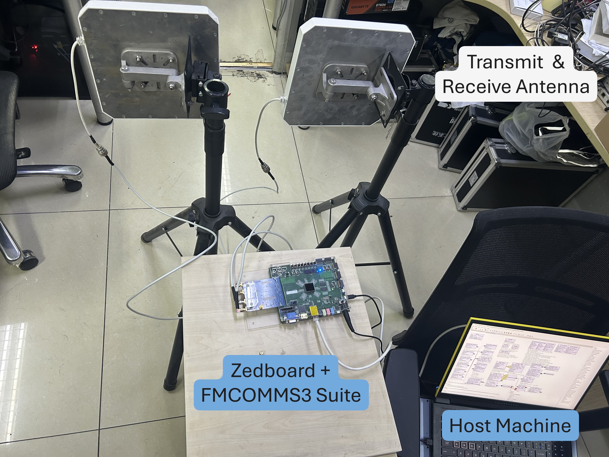

# UHF-Gen2-RFID-Reader

Author: [NaXin](https://wonderfulnx.github.io/)

A high performance UHF Gen2 RFID Reader, using FPGA-based SDR platform (ADI FMCOMMS2/3 with Xilinx Zynq SoC).

Developed as part of our research project [QuinID](https://github.com/wonderfulnx/QuinID), this RFID reader is also a by-product of the system's design efforts.

## Reader Setup Guide

The FPGA based reader can run on an Zedboard + FMCOMMS2/3 platform, with a custom IP core for reader implementation. In general, we need to set up both the hardware (HW) and the software (SW) for the RFID reader, where the hardware specifically means the FPGA image, and the software means the method of interacting with the FPGA. Here we record a detailed step-by-step guide on setting up the reader.

### 1. What you need to get started
1. Zedboard + FMCOMMS2/3 boards, follow the guide of `Linux on ZC702, ZC706, ZED` in [AD-FMCOMMS3-EBZ User Guide](https://wiki.analog.com/resources/eval/user-guides/ad-fmcomms3-ebz) to set up the hardware.
2. an SD card (not a TF card) with at least 16GB size.
3. Connect the hardware with your computer following the guide `Linux on ZC702, ZC706, ZED`, it's OK not to connect monitor and OTG mouse and keyboards, but it is improtant to have a UART serial connection and network cable connection.

### 2. Hardware setup guide

1. Download the Kuiper Linux SD card image of the `2022_r2 Patch 2` version from [Analog Devices Kuiper Linux](https://wiki.analog.com/resources/tools-software/linux-software/kuiper-linux), namely `18 June 2024 release (2022_r2 Patch 2)`. We also suggest reading and following ADI's guide on this suite: [AD-FMCOMMS3-EBZ User Guide](https://wiki.analog.com/resources/eval/user-guides/ad-fmcomms3-ebz).
2. Imaging the SD Card according to ADI's guide, using whatever tool. 
3. As shown in the guide, configuring the SD card for the specific suite requires copying some files to the root of the BOOT partition in the SD card. The files includes `BOOT.BIN`, `devicetree.dtb`, and `uImage`. Details are in [Analog Devices Kuiper Linux](https://wiki.analog.com/resources/tools-software/linux-software/kuiper-linux?redirect=2). In order to work with our RFID reader, use the the boot files we provide inside `KuiperLinuxBootFiles` folder. Different BLF settings uses different `BOOT.BIN` files, so use the one you prefer. The measured maximum reading rate for one tag are as follows:
    | RFID BLF      | Read rate (per second) |
    | ------------- | ---------------------- |
    | 40kHz         | 158 times              |
    | 80kHz         | 257 times              |
    | 120kHz        | 366 times              |
    | 160kHz        | 479 times              |
    | 200kHz        | 607 times              |
    | 320kHz        | 930 times              |
    | 640kHz        | 1170~1200 times        |

4. If your suite doesn't work, you can continue with the [AD-FMCOMMS2/3/4/5-EBZ Zynq and ZED Quick Start Guide](https://wiki.analog.com/resources/eval/user-guides/ad-fmcomms2-ebz/quickstart/zynq) by using the official `BOOT.BIN`, `devicetree.dtb`, and `uImage` files. Then you can try some simple streaming application with iio-oscilloscope or GNURadio in your host machine. Make sure the hardware setup works fine in its original form.
5. We use the `TX1A` and `RX1A` port for the transmit and receive chain, therefore you will need two antennas. Another important thing to note is that the FMCOMMS2/3 board has an output power of only 0dBm, so a **power amplifier** is needed for long range reading. One example of deployment is:

### 3. Software Interface Guide

1. Setup the IP address of the suite using `enable_static_ip.sh 192.168.20.2` in the serial terminal. Then, you can have access to the hardware using Ethernet connection.
2. Open `ad9361_rfidreader.grc` with GNURadio. I suggest installing it on Windows with `msys2` so that the latest version with fewer bugs can always be used.
3. We have many comments in the grc file, so it is pretty self-explanatory. Generally speaking, the current software interface allows you to record two signals from the DMAs. It saves the recorded signal in the `signals` folder.
4. If you want to run the `show_decode_result.m`, set DMA0 to `decode_result` and then record the signals. You can also view the signals using the Simulink model `view_sig.slx`
5. Alternatively, you can develope your own software interface tools. Our interface uses the general `libiio` interface by ADI. Check [What is libiio?](https://wiki.analog.com/resources/tools-software/linux-software/libiio#libiio_-_ad9361_iio_streaming_example) and [AD9361 Linux device driver](https://wiki.analog.com/resources/tools-software/linux-drivers/iio-transceiver/ad9361) for more information. Our RFID IP has its own iio_device named `axi-rfidreader` to change reading parameters.

## Usage Notice

Please **cite** the following paper if you use this tool:

Xin Na, Jia Zhang, Jiacheng Zhang, Xiuzhen Guo, Yang Zou, Meng Jin, Yimiao Sun, Yunhao Liu, Yuan He. 2025. QuinID: Enabling FDMA-Based Fully Parallel RFID with Frequency-Selective Antenna. In The 31st Annual International Conference on Mobile Computing and Networking (ACM MOBICOM ’25), November 4–8, 2025, Hong Kong, China. ACM, New York, NY, USA, 15 pages. https://doi.org/10.1145/3680207.3723462.

Also, if you have any questions, or want your own modification on the FPGA hardware, contact me with nx20@mails.tsinghua.edu.cn or this Github account.